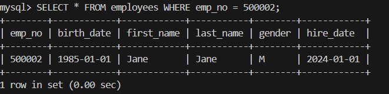
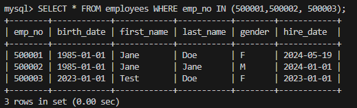
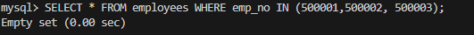

# CRUD Operations Test Cases

## Objective
The objective of this document is to document and test CRUD (Create, Read, Update, Delete) operations on the employees table.

## Test Case 1: Create Operation
- **Description**: Insert a new employee into the employees table.
- **Query**:
  ```sql
  INSERT INTO employees (emp_no, birth_date, first_name, last_name, gender, hire_date)
  VALUES (500002, '1985-01-01', 'Jane', 'Doe', 'F', '2024-01-01');

Expected Result: A new employee record is added to the employees table.
Verification:



## Test Case 2: Read Operation
- **Description**: read the  new employee into the employees table.
- **Query**:
  ```sql
    SELECT * FROM employees WHERE emp_no IN (500001, 500002)



## Test Case 3: Update Operation
- **Description**: update  new employee into the employees table.
- **Query**:
  ```sql
    UPDATE employees
    SET birth_date = '2023-01-01',
    hire_date = '2023-01-01'
    WHERE emp_no = 500003;


## Test Case 4: Delete Operation
- **Description**: Delete   all new employee into the employees table.
- **Query**:
  ```sql
    DELETE FROM employees
    WHERE emp_no IN (500001, 500002, 500003, 500004);

