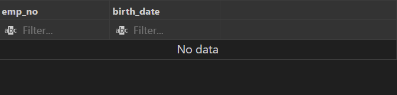

# Data Integrity Tests

This document details the data integrity tests performed on the `employees` database. These tests ensure that the data adheres to specific integrity constraints.

## 1. Entity Integrity Test

**Objective**: Ensure each employee has a unique `emp_no`.

**SQL Query**:

```sql
-- Check that each employee has a unique emp_no
SELECT emp_no, COUNT(*)
FROM employees
GROUP BY emp_no
HAVING COUNT(*) > 1;
```


## 2. Entity Integrity Test

** Objective**: Ensure there are no orphaned records in the `departments` table.

**SQL Query**:
```sql
-- Referential Integrity Test: Check for orphaned records in the departments table

SELECT dept_no
FROM departments
WHERE dept_no NOT IN (SELECT dept_no FROM dept_emp);
```


## 3. Domain Integrity Test

**Objective**: Ensure all `birth_date` values are within the defined range.

**SQL Query**:
```sql
-- Domain Integrity Test
-- Objective: Ensure all birth_date values are within the defined range

SELECT emp_no, birth_date
FROM employees
WHERE birth_date NOT BETWEEN '1900-01-01' AND CURDATE();

```



## 4. User-Defined Integrity Test 

**Objective**: Ensure all `birth_date` values are within the defined range.

**SQL Query**:
```sql

-- User-Defined Integrity Test
-- Objective: Ensure hire_date is always after birth_date

SELECT emp_no, birth_date, hire_date
FROM employees
WHERE hire_date <= birth_date;
```
